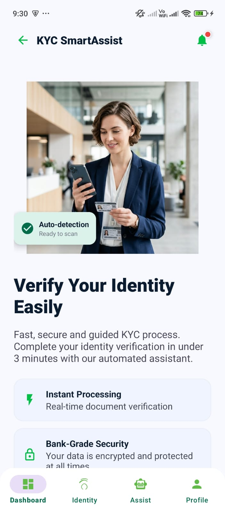
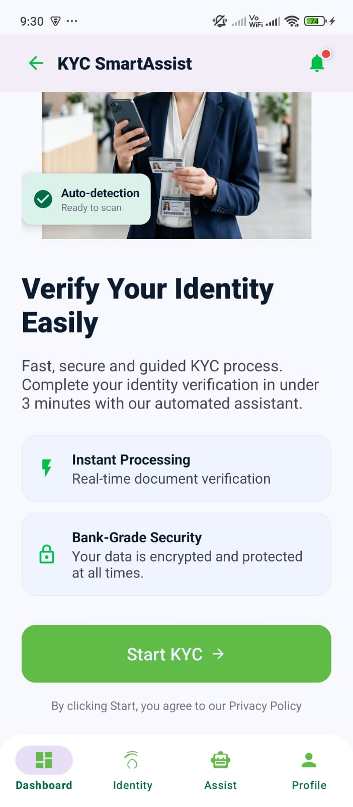
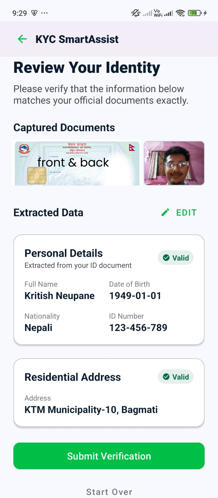
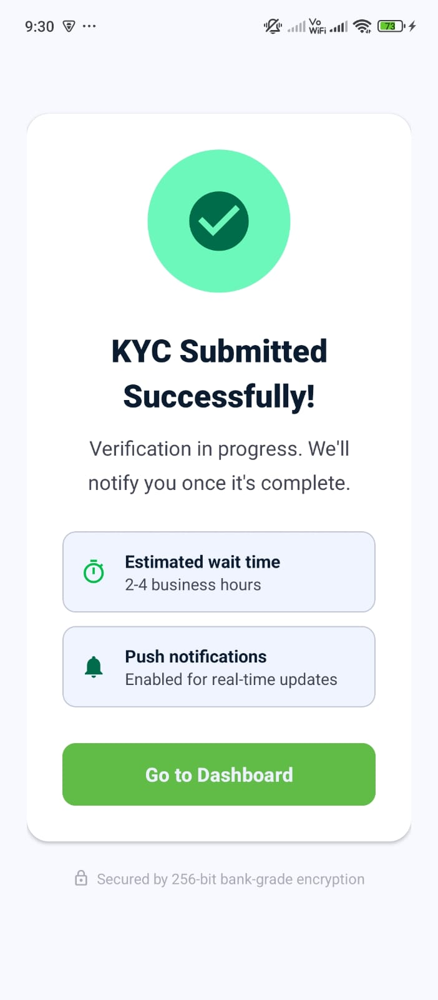
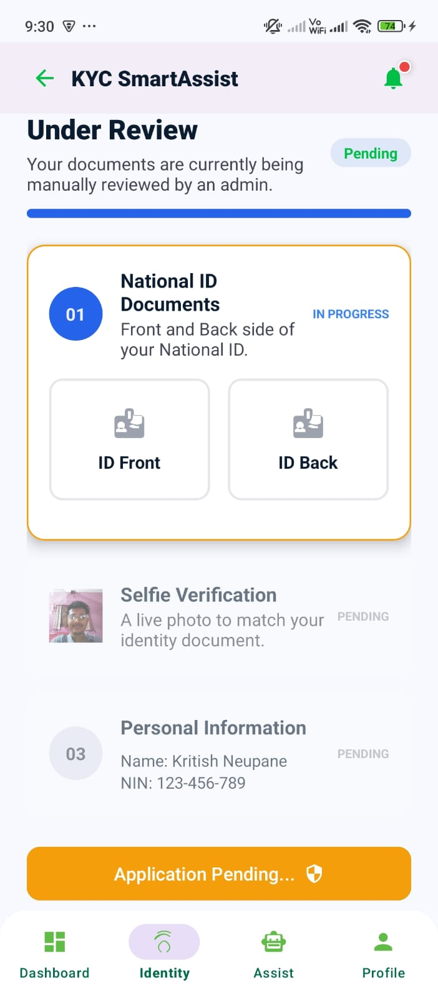
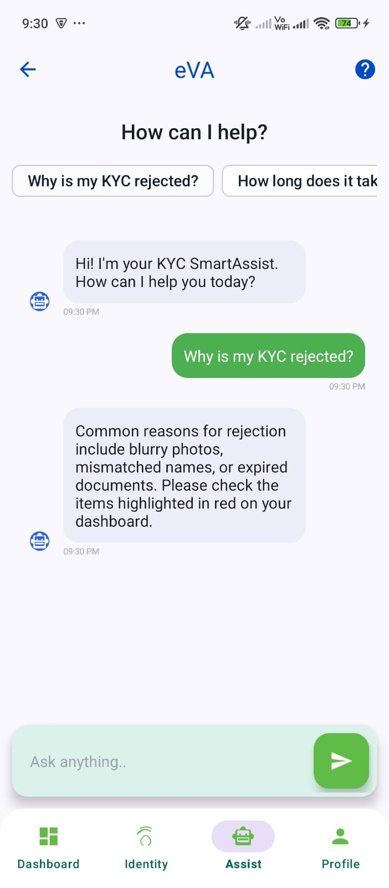
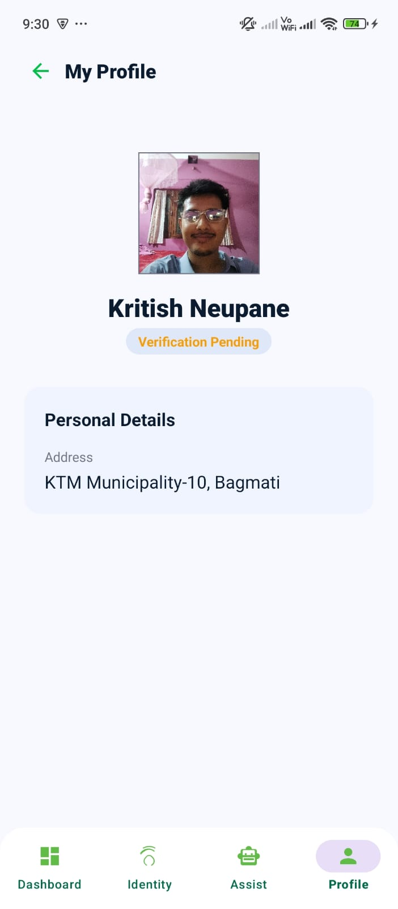
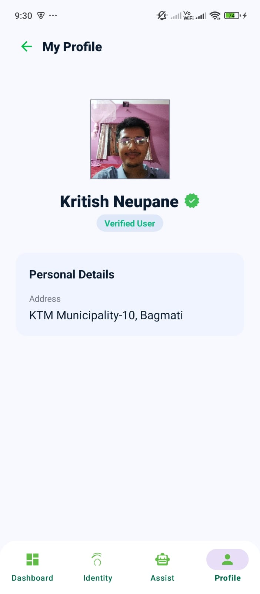
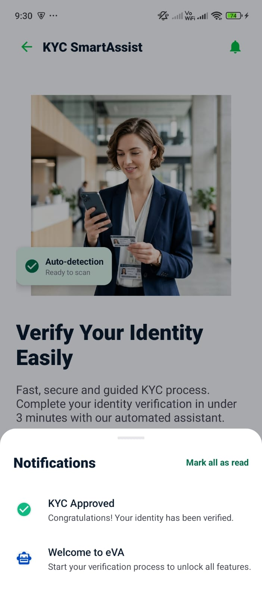
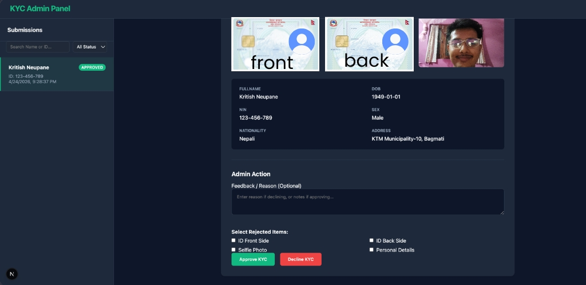

# eSewa KYC Verification System

> **Built for eSewa Challenge 4 — Intelligent KYC Experience**  
> *Faster onboarding. Fewer errors. Smarter support.*

---

## 📸 Screenshots

### Android App
| Home | Get Started | Review & Submit |
|:---:|:---:|:---:|
|  |  |  |

| Submission | Waiting | Virtual Assistant |
|:---:|:---:|:---:|
|  |  |  |

| Profile | Notifications | Verified |
|:---:|:---:|:---:|
|  |  |  |

### Admin Panel


---

## 📱 Overview

A full-stack KYC (Know Your Customer) onboarding system consisting of:

- **Android App** — Smart identity verification client for users
- **Next.js Admin Backend** — Web-based admin panel for reviewing and managing submissions

---

## 🏗️ Repository Structure

```
KYCVerification/
├── app/                         ← Android KYC Client (Java)
│   └── src/main/java/app/kyc/verification/
│       ├── Config.java          ← ⚙️  API endpoint configuration
│       ├── MainActivity.java    ← Home screen + notifications
│       ├── KycDashboardActivity.java  ← 4-step KYC progress dashboard
│       ├── DocumentCaptureActivity.java  ← OCR-powered NID capture
│       ├── SelfieVerificationActivity.java
│       ├── ReviewSubmitActivity.java
│       ├── PersonalInfoActivity.java   ← Manual entry + real-time validation
│       ├── KycSmartAssistActivity.java ← Status-aware AI chatbot
│       └── ProfileActivity.java
│
└── backend/                     ← Next.js Admin Panel (Node.js)
    ├── src/app/
    │   ├── page.js              ← Admin dashboard UI
    │   └── api/kyc/
    │       ├── route.js         ← POST /api/kyc, GET /api/kyc
    │       ├── [id]/route.js    ← PUT /api/kyc/:id, DELETE /api/kyc/:id
    │       └── user/[uid]/route.js ← GET /api/kyc/user/:uid
    ├── kyc_data.json            ← 🔒 Live database (gitignored)
    ├── kyc_data.template.json   ← Safe empty template
    └── public/uploads/          ← 🔒 User document photos (gitignored)
```

---

## ✨ Key Features

### Android App
| Feature | Implementation |
|---|---|
| **Automated NID Extraction** | Google ML Kit OCR (Devanagari support) |
| **Real-time Form Validation** | TextWatcher with per-field error hints |
| **4-Step Progress Dashboard** | Animated engine with real-time server polling |
| **Smart Rejection Routing** | Opens only the rejected step, skips the rest |
| **Status-Aware SmartAssist** | Chatbot reads current KYC status and responds contextually |
| **"What does this mean?" Link** | Opens SmartAssist for instant support, reducing tickets |
| **Document Thumbnail Persistence** | Dashboard shows captured ID and selfie after submission |
| **Premium Slide Navigation** | Custom XML animation set for all screen transitions |
| **Verified Badge** | Green tick icon displayed on Approved profiles |

### Admin Backend
| Feature | Implementation |
|---|---|
| **Submissions Dashboard** | Search + filter by name, NID, or status |
| **Document Image Review** | View Front ID, Back ID, and Selfie side-by-side |
| **Approve / Decline** | One-click status update sent to mobile app instantly |
| **Per-field Rejection** | Select exactly which items to reject (Front, Back, Selfie, Details) |
| **Feedback Messages** | Admin notes pushed to user's dashboard and SmartAssist |
| **Edit Applicant Data** | Inline editing of personal details |
| **Decline History** | Full audit trail of previous declines per applicant |
| **Delete Submission** | Permanently remove an application |

---

## 🚀 Getting Started

### Prerequisites
- **Android Studio** Hedgehog or later
- **Node.js** v18 or later
- Both devices on the **same local network** (or use a deployed backend URL)

---

### 1. Start the Backend (Admin Panel)

```bash
cd backend

# First time only: copy the template database
cp kyc_data.template.json kyc_data.json

npm install
npm run dev
```

The admin panel will be available at **http://localhost:3001**

> **Default port is 3000.** To use port 3001, update your `package.json`:
> ```json
> "dev": "next dev -p 3001"
> ```

---

### 2. Configure the Android App

Edit `app/src/main/java/app/kyc/verification/Config.java`:

```java
// Change this to your machine's local network IP
// Find it with: ipconfig (Windows) or ifconfig (Mac/Linux)
public static final String BASE_URL = "http://YOUR_LOCAL_IP:3001";
```

> ⚠️ Use your **network IP** (e.g. `192.168.1.x`), not `localhost` — the Android device cannot reach your laptop via `localhost`.

---

### 3. Build & Run the Android App

Open the project root in **Android Studio** and run on a **physical device** (API 26+).

> ML Kit OCR works best on physical devices. Emulators may have limited camera/gallery access.

---

## 🔌 API Reference

| Method | Endpoint | Description |
|---|---|---|
| `POST` | `/api/kyc` | Submit a new KYC application (multipart/form-data) |
| `GET` | `/api/kyc` | Fetch all submissions (admin use) |
| `GET` | `/api/kyc/user/:uid` | Fetch a specific user's KYC status |
| `PUT` | `/api/kyc/:id` | Update status, feedback, rejected fields |
| `DELETE` | `/api/kyc/:id` | Permanently delete a submission |

---

## 🔐 Security Notes

- `kyc_data.json` — contains personal user data. **Never commit this file.**
- `public/uploads/` — contains identity document photos. **Never commit this directory.**
- `Config.java` — contains your local IP address. For production, move to environment variables.

---

## 📋 Requirements

| Component | Requirement |
|---|---|
| Android Min SDK | 26 (Android 8.0 Oreo) |
| Android Target SDK | 34 |
| Backend Runtime | Node.js 18+ |
| Backend Framework | Next.js 16.2.4 |

---

## 🏆 About

Built for **eSewa Innovation Hackathon — Challenge 4: Intelligent KYC Experience**

> *"Design a smart KYC onboarding solution that reduces errors during data entry, improves transparency of KYC progress and verification outcomes, and reduces KYC-related support inquiries."*
